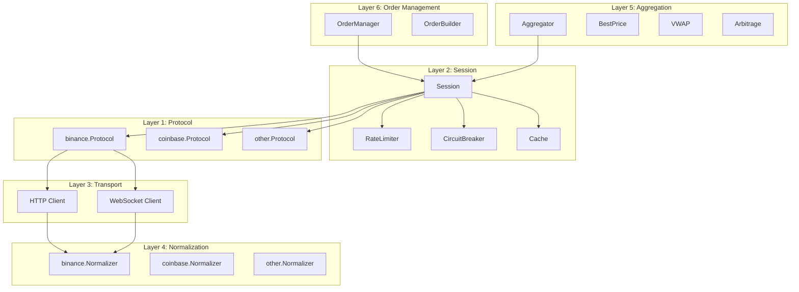
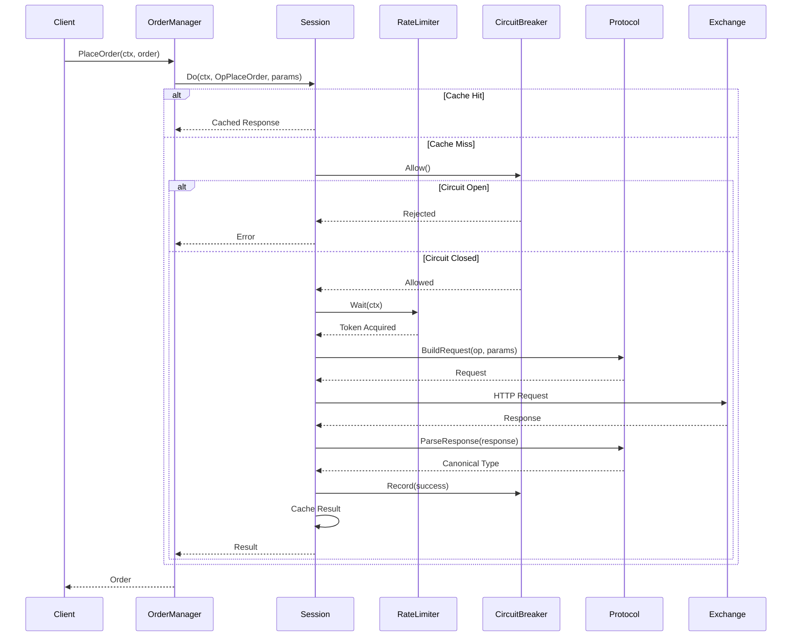

# Sadewa

A high-performance, type-safe multi-exchange trading library for Go. Built with explicit design principles, compile-time safety, and arbitrary-precision decimal arithmetic for financial accuracy.

## Features

### Core Types

| Type        | Description                                                  |
| ----------- | ------------------------------------------------------------ |
| `Ticker`    | Real-time market data with bid, ask, last, high, low, volume |
| `Order`     | Exchange order with full lifecycle tracking                  |
| `Balance`   | Account balance with free and locked amounts                 |
| `Trade`     | Executed trade with fee information                          |
| `Kline`     | Candlestick/OHLCV data                                       |
| `OrderBook` | Order book snapshot with bid/ask levels                      |

### Order Management

- **OrderSide**: Buy, Sell
- **OrderType**: Market, Limit, StopLoss, StopLossLimit, TakeProfit, TakeProfitLimit
- **OrderStatus**: New, PartiallyFilled, Filled, Canceling, Canceled, Rejected, Expired
- **TimeInForce**: GTC (Good Till Cancel), IOC (Immediate Or Cancel), FOK (Fill Or Kill)

### Infrastructure

- **Rate Limiting**: Token bucket algorithm with global and per-bucket limits
- **Circuit Breaker**: Three-state pattern (Closed, Open, HalfOpen) for fault tolerance
- **Caching**: Configurable TTL caching for market data
- **WebSocket**: Automatic reconnection with exponential backoff

### Multi-Exchange Aggregation

- Best price discovery across exchanges
- VWAP (Volume-Weighted Average Price) calculation
- Merged order book aggregation
- Cross-exchange arbitrage detection

---

## Architecture

Sadewa implements a 6-layer architecture designed for modularity and extensibility.



### Request Flow



---

## Supported Exchanges

### Binance (Spot)

| Feature           | REST API | WebSocket |
| ----------------- | :------: | :-------: |
| Get Ticker        |   Yes    |    Yes    |
| Get Order Book    |   Yes    |    Yes    |
| Get Trades        |   Yes    |    Yes    |
| Get Klines        |   Yes    |    Yes    |
| Get Balance       |   Yes    |     -     |
| Place Order       |   Yes    |     -     |
| Cancel Order      |   Yes    |     -     |
| Get Order         |   Yes    |     -     |
| Get Open Orders   |   Yes    |     -     |
| Get Order History |   Yes    |     -     |

### Planned Exchanges

| Exchange | Priority | Status  |
| -------- | :------: | :-----: |
| Coinbase |   High   | Planned |
| Kraken   |   High   | Planned |
| Bybit    |   High   | Planned |
| OKX      |   High   | Planned |
| Huobi    |  Medium  | Planned |
| KuCoin   |  Medium  | Planned |
| Gate.io  |  Medium  | Planned |
| Bitfinex |  Medium  | Planned |

---

## Installation

```bash
go get github.com/your-org/sadewa
```

### Dependencies

| Package                         | Purpose                                |
| ------------------------------- | -------------------------------------- |
| `github.com/cockroachdb/apd/v3` | Arbitrary-precision decimal arithmetic |
| `github.com/go-resty/resty/v2`  | HTTP client with retries               |
| `github.com/bytedance/sonic`    | High-performance JSON serialization    |
| `github.com/rs/zerolog`         | Zero-allocation structured logging     |
| `github.com/lxzan/gws`          | High-performance WebSocket             |
| `golang.org/x/time`             | Rate limiting                          |

---

## Quick Start

### Basic Ticker Fetch

```go
package main

import (
    "context"
    "fmt"
    "time"

    "sadewa/pkg/core"
    "sadewa/pkg/exchanges/binance"
    "sadewa/pkg/session"
)

func main() {
    ctx, cancel := context.WithTimeout(context.Background(), 10*time.Second)
    defer cancel()

    config := core.DefaultConfig("binance")
    sess, err := session.New(config)
    if err != nil {
        panic(err)
    }
    defer sess.Close()

    sess.SetProtocol(binance.New())

    ticker, err := sess.GetTicker(ctx, "BTC/USDT")
    if err != nil {
        panic(err)
    }

    fmt.Printf("BTC/USDT: Bid=%s Ask=%s Last=%s\n",
        ticker.Bid.String(),
        ticker.Ask.String(),
        ticker.Last.String())
}
```

### Place Order

```go
package main

import (
    "context"
    "fmt"

    "sadewa/pkg/core"
    "sadewa/pkg/exchanges/binance"
    "sadewa/pkg/ordermanager"
    "sadewa/pkg/session"
)

func main() {
    ctx := context.Background()

    config := core.DefaultConfig("binance").
        WithCredentials(&core.Credentials{
            APIKey:    "your-api-key",
            SecretKey: "your-secret-key",
        })

    sess, _ := session.New(config)
    defer sess.Close()
    sess.SetProtocol(binance.New())

    order, err := ordermanager.NewOrderBuilder("BTC/USDT").
        Buy().
        Limit().
        Price("50000").
        Quantity("0.001").
        GTC().
        ClientOrderID("my-order-001").
        Build()
    if err != nil {
        panic(err)
    }

    manager := ordermanager.NewManager(sess, ordermanager.ManagerConfig{
        EnableValidation: true,
    })

    manager.OnOrderUpdate(func(o *core.Order) {
        fmt.Printf("Order %s status: %s\n", o.ID, o.Status)
    })

    if err := manager.PlaceOrder(ctx, order); err != nil {
        panic(err)
    }

    fmt.Printf("Order placed: ID=%s\n", order.ID)
}
```

### WebSocket Subscription

```go
package main

import (
    "context"
    "fmt"
    "os"
    "os/signal"
    "syscall"

    "sadewa/pkg/core"
    "sadewa/pkg/exchanges/binance"
)

func main() {
    ctx, cancel := context.WithCancel(context.Background())
    defer cancel()

    wsClient := binance.NewBinanceWSClient(false) // false = production

    if err := wsClient.Connect(ctx); err != nil {
        panic(err)
    }
    defer wsClient.Close()

    wsClient.SubscribeTicker("BTC/USDT", func(ticker *core.Ticker) {
        fmt.Printf("[%s] Bid: %s | Ask: %s\n",
            ticker.Timestamp.Format("15:04:05"),
            ticker.Bid.String(),
            ticker.Ask.String())
    })

    wsClient.SubscribeOrderBookDepth("ETH/USDT", 10, 100, func(ob *core.OrderBook) {
        if len(ob.Bids) > 0 && len(ob.Asks) > 0 {
            fmt.Printf("Best Bid=%s | Best Ask=%s\n",
                ob.Bids[0].Price.String(),
                ob.Asks[0].Price.String())
        }
    })

    sigChan := make(chan os.Signal, 1)
    signal.Notify(sigChan, syscall.SIGINT, syscall.SIGTERM)
    <-sigChan
}
```

### Multi-Exchange Aggregation

```go
package main

import (
    "context"
    "fmt"

    "sadewa/pkg/aggregator"
    "sadewa/pkg/core"
    "sadewa/pkg/exchanges/binance"
    "sadewa/pkg/session"
)

func main() {
    ctx := context.Background()

    binanceConfig := core.DefaultConfig("binance")
    binanceSession, _ := session.New(binanceConfig)
    binanceSession.SetProtocol(binance.New())

    agg := aggregator.NewAggregator()
    agg.AddSession("binance", binanceSession)

    bestPrice, err := agg.GetBestPrice(ctx, "BTC/USDT")
    if err != nil {
        panic(err)
    }
    fmt.Printf("Best Bid: %s @ %s\n", bestPrice.Bid.String(), bestPrice.BidExchange)
    fmt.Printf("Best Ask: %s @ %s\n", bestPrice.Ask.String(), bestPrice.AskExchange)

    vwap, err := agg.GetVWAP(ctx, "BTC/USDT", 20)
    if err != nil {
        panic(err)
    }
    fmt.Printf("VWAP: %s (Volume: %s)\n", vwap.VWAP.String(), vwap.Volume.String())
}
```

---

## Configuration

```go
type Config struct {
    Exchange    string        `json:"exchange"`
    Sandbox     bool          `json:"sandbox"`
    Credentials *Credentials  `json:"credentials"`

    Timeout       time.Duration `json:"timeout"`
    MaxRetries    int           `json:"max_retries"`
    RetryWaitMin  time.Duration `json:"retry_wait_min"`
    RetryWaitMax  time.Duration `json:"retry_wait_max"`

    RateLimitRequests int           `json:"rate_limit_requests"`
    RateLimitPeriod   time.Duration `json:"rate_limit_period"`

    CacheEnabled bool          `json:"cache_enabled"`
    CacheTTL     time.Duration `json:"cache_ttl"`

    CircuitBreakerEnabled          bool          `json:"circuit_breaker_enabled"`
    CircuitBreakerFailThreshold    int           `json:"circuit_breaker_fail_threshold"`
    CircuitBreakerSuccessThreshold int           `json:"circuit_breaker_success_threshold"`
    CircuitBreakerTimeout          time.Duration `json:"circuit_breaker_timeout"`

    LogLevel string `json:"log_level"`
}
```

### Default Values

| Setting                        | Default |
| ------------------------------ | ------- |
| Timeout                        | 10s     |
| MaxRetries                     | 3       |
| RetryWaitMin                   | 100ms   |
| RetryWaitMax                   | 1s      |
| RateLimitRequests              | 1200    |
| RateLimitPeriod                | 1m      |
| CacheEnabled                   | true    |
| CacheTTL                       | 1s      |
| CircuitBreakerFailThreshold    | 5       |
| CircuitBreakerSuccessThreshold | 2       |
| CircuitBreakerTimeout          | 30s     |

### Config Builder

```go
config := core.DefaultConfig("binance").
    WithCredentials(&core.Credentials{APIKey: "...", SecretKey: "..."}).
    WithSandbox(true).
    WithTimeout(30 * time.Second).
    WithRateLimit(600, time.Minute).
    WithCache(true, 2*time.Second)
```

---

## Package Structure

```
sadewa/
├── pkg/                          # Public API
│   ├── core/                     # Types, interfaces, config
│   │   ├── types.go
│   │   ├── config.go
│   │   ├── operation.go
│   │   ├── errors.go
│   │   ├── protocol.go
│   │   └── request.go
│   │
│   ├── session/                  # Session management
│   │   └── session.go
│   │
│   ├── exchanges/                # Exchange protocols
│   │   ├── registry.go
│   │   └── binance/
│   │       ├── protocol.go
│   │       ├── normalizer.go
│   │       ├── websocket.go
│   │       └── doc.go
│   │
│   ├── ordermanager/             # Order lifecycle
│   │   ├── manager.go
│   │   └── builder.go
│   │
│   └── aggregator/               # Multi-exchange aggregation
│       └── aggregator.go
│
└── internal/                     # Private implementation
    ├── transport/
    │   ├── http.go
    │   └── websocket.go
    ├── ratelimit/
    │   └── limiter.go
    └── circuitbreaker/
        └── breaker.go
```

---

## Session API Reference

Session provides typed methods for all exchange operations. These methods handle request building, rate limiting, circuit breaker, caching, and response normalization automatically.

### Market Data Methods

```go
ticker, err := session.GetTicker(ctx, "BTC/USDT")

orderBook, err := session.GetOrderBook(ctx, "BTC/USDT", 100)

trades, err := session.GetTrades(ctx, "BTC/USDT", 500)

klines, err := session.GetKlines(ctx, "BTC/USDT", "1h", 100)
```

### Account Methods

```go
balances, err := session.GetBalance(ctx)
```

### Order Methods

```go
order, err := session.PlaceOrder(ctx, &core.Order{
    Symbol:   "BTC/USDT",
    Side:     core.SideBuy,
    Type:     core.TypeLimit,
    Price:    price,
    Quantity: qty,
    TimeInForce: core.GTC,
})

order, err := session.CancelOrder(ctx, "BTC/USDT", "order-id")

order, err := session.GetOrder(ctx, "BTC/USDT", "order-id")

orders, err := session.GetOpenOrders(ctx, "BTC/USDT")

orders, err := session.GetOrderHistory(ctx, "BTC/USDT", startTime, endTime, 100)
```

### Low-Level Method

For operations not covered by typed methods:

```go
result, err := session.Do(ctx, core.Operation, core.Params{"key": "value"})
```

---

## Error Handling

```go
type ExchangeError struct {
    Type       ErrorType
    StatusCode int
    Code       string
    Message    string
    RawError   error
    Exchange   string
    Timestamp  time.Time
}
```

### Error Types

| Type                         | Description                 | Retryable |
| ---------------------------- | --------------------------- | :-------: |
| `ErrorTypeNetwork`           | Network connectivity issues |    Yes    |
| `ErrorTypeTimeout`           | Request timeout             |    Yes    |
| `ErrorTypeRateLimit`         | Rate limit exceeded         |    Yes    |
| `ErrorTypeAuthentication`    | Invalid credentials         |    No     |
| `ErrorTypeBadRequest`        | Invalid request parameters  |    No     |
| `ErrorTypeNotFound`          | Resource not found          |    No     |
| `ErrorTypeServerError`       | Exchange server error       |    Yes    |
| `ErrorTypeInsufficientFunds` | Not enough balance          |    No     |
| `ErrorTypeInvalidOrder`      | Order validation failed     |    No     |

### Helper Functions

```go
if core.IsNetworkError(err) {
    // Retry with backoff
}

if core.IsRateLimitError(err) {
    // Wait and retry
}

if core.IsTerminalError(err) {
    // Do not retry
}
```

---

## Performance

### Targets (p95)

| Operation       | Target  |
| --------------- | ------- |
| REST API        | < 100ms |
| WebSocket       | < 10ms  |
| Cache Hit       | < 1ms   |
| Order Placement | < 150ms |

### Throughput

| Metric             | Target     |
| ------------------ | ---------- |
| REST Requests      | 100-1000/s |
| WebSocket Messages | 10,000/s   |
| Concurrent Orders  | 1,000/s    |

### Memory

| Component            | Usage    |
| -------------------- | -------- |
| Base Session         | 10-20 MB |
| Per Order            | ~1 KB    |
| Cache (1000 entries) | 5-10 MB  |
| WebSocket Connection | 2-5 MB   |

---

## Design Principles

### 1. Explicit Over Implicit

All operations and types are explicitly defined. No magic behavior or hidden state.

### 2. Compile-Time Safety

Typed enumerations and static registration catch errors at compile time, not runtime.

### 3. Arbitrary-Precision Decimals

All financial numbers use `apd.Decimal` to avoid floating-point precision issues.

### 4. Zero-Allocation Hot Paths

Critical paths minimize allocations using sync pools and efficient serialization.

### 5. Fail Fast and Loud

Errors are returned immediately with full context. No silent failures or default values.

---

## Roadmap

### Phase 1: Core Infrastructure (Completed)

- Core types and interfaces
- Rate limiting
- Circuit breaker
- HTTP transport

### Phase 2: Session Management (Completed)

- Session lifecycle
- Cache integration
- Error handling

### Phase 3: Binance Protocol (Completed)

- REST API implementation
- WebSocket streams
- Type normalization

### Phase 4: WebSocket Support (Completed)

- Generic WebSocket client
- Reconnection logic
- Binance stream subscriptions

### Phase 5: Order Management (Completed)

- Order builder pattern
- Lifecycle tracking
- Callback system

### Phase 6: Aggregation (Completed)

- Multi-exchange aggregation
- VWAP calculation
- Arbitrage detection

### Future: Phase 7+

| Feature                   | Description                       |
| ------------------------- | --------------------------------- |
| Additional Exchanges      | Coinbase, Kraken, Bybit, OKX      |
| Futures Support           | Perpetual and dated futures       |
| Margin Trading            | Margin order types                |
| Order Book Depth Analysis | Level 2/3 data processing         |
| Historical Data           | Backtesting support               |
| Batch Operations          | Bulk order placement/cancellation |
| Position Tracking         | Portfolio management              |

---

## Contributing

1. Fork the repository
2. Create a feature branch
3. Ensure tests pass: `go test ./...`
4. Ensure linting passes: `golangci-lint run`
5. Submit a pull request

### Adding a New Exchange

1. Create `pkg/exchanges/<exchange>/`
2. Implement `core.Protocol` interface
3. Implement normalizer methods
4. Add WebSocket support if applicable
5. Register in `pkg/exchanges/registry.go`
6. Write tests with 80%+ coverage

---

## License

MIT License

---

## Acknowledgments

Built with high-quality open source libraries:

- [cockroachdb/apd](https://github.com/cockroachdb/apd) - Arbitrary-precision decimals
- [go-resty/resty](https://github.com/go-resty/resty) - HTTP client
- [bytedance/sonic](https://github.com/bytedance/sonic) - JSON serialization
- [rs/zerolog](https://github.com/rs/zerolog) - Structured logging
- [lxzan/gws](https://github.com/lxzan/gws) - WebSocket client
